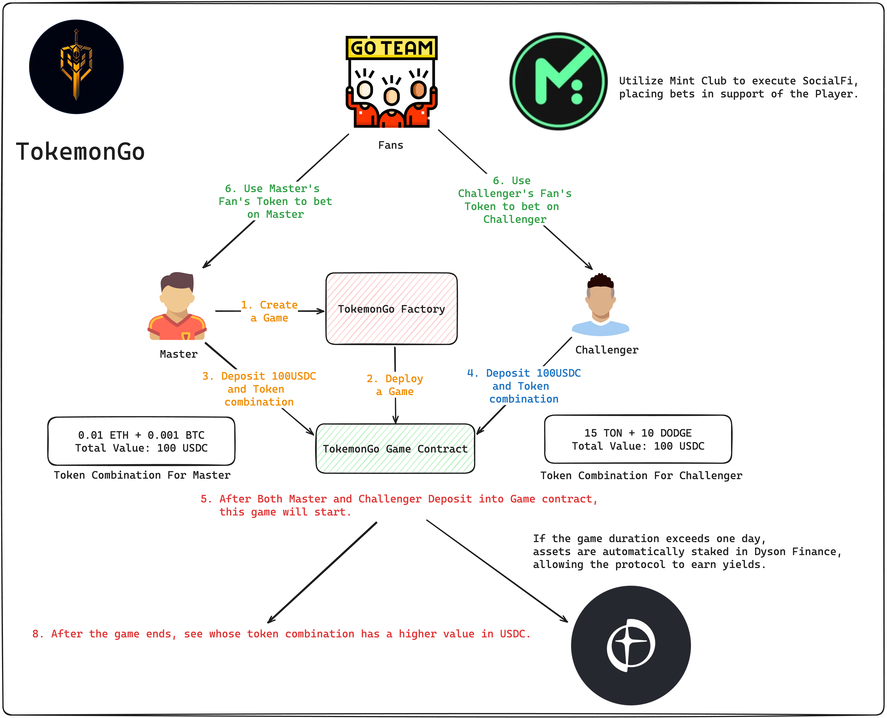

# TokemoGo For ETH Taipei 2024

## Introduction


- **Game Setup:** The Master sets a game collateral threshold, such as 100 USDC, and the game's deadline.
- **Token Combination For Master:** Master create a token combination equal to the value of 100 USDC (for example, "0.01 ETH and 0.001 BTC = Total 100 USDC").
- **Token Combination For Challenger** Challengers can stake 100 USDC to propose a better token combination. 
- **Who can Win?** The winner is the one with the higher value asset combination when the game time ends.

**Yield Generation:**

- If the game duration exceeds one day, staked assets are invested in Dyson Finance through dual investment strategies, generating yields for GameFi, SocialFi, and NFT DApps.

**SocialFi Integration:**

- **Fan Tokens:** Mint Club is used to create fan tokens for Masters and Challengers, allowing the community to purchase fan tokens of the players they support and bet on their game outcomes.
- **Mechnism For Fans Token:** The losing side's fan tokens are burned, enhancing the value of the winning side's fan tokens.

---
## Architecture


## How To Run?

```
git clone https://github.com/IPromiseSmartContract/TokemonGo.git
cd TokemonGo
cp .env.example .env
# After copying the .env.example file to .env, you'll need to fill in the following fields in the .env file:
# SEP_URL = "" - The URL for your Sepolia Endpoint.
# SEPOLIA_PRIVATE_KEY="" - Your private key for the Sepolia network wallet.
# ETHER_SCAN_API_KEY="" - Your API key for Etherscan,.
yarn install
yarn test

```
